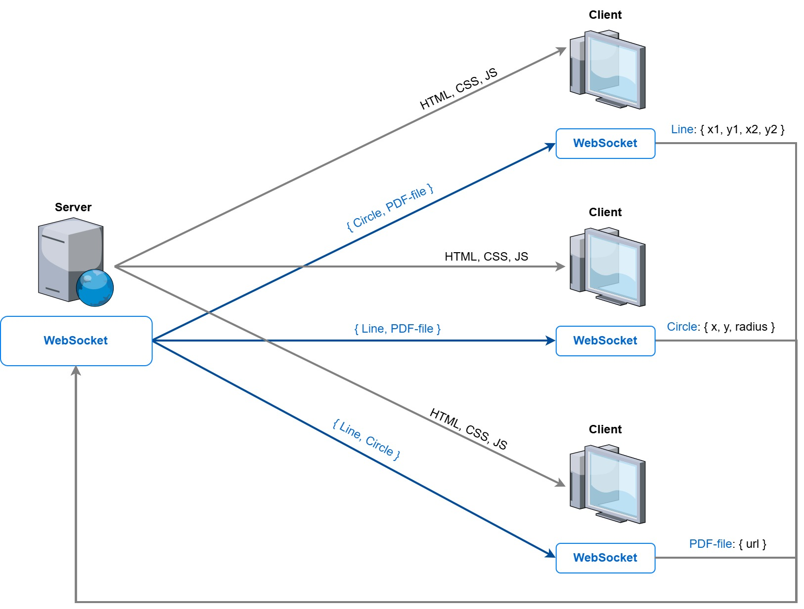

# penco

## About
A web application for collaboratively drawing and building various geometric shapes on canvas in real time.  
You can upload PDF documents to the graphic canvas as separate objects and draw on their pages.

## Architecture
The architecture of a web application consists of three main components: the server side, the client side, and the
WebSocket protocol.

## Dependencies
- **Node.js** v16.20.1 or later;
- **npm** v8.19.4 or later.

## Installation and launch
- clone the repository;
- in the project root and inside the [backend](backend) and [frontend](frontend) directories run the command:
  - `npm i`
- inside the [backend](backend) directory run the command:
  - `npm run dev`
- inside the [frontend](frontend) directory run the command:
  - `npm run build`
  - `npm run start`
- open http://localhost:3000/.

To run the site later, just run the `npm run dev` and `npm run start` commands.

## Technologies
### Real-time mode
WebSocket protocol:
  - backend: [socket.io](https://www.npmjs.com/package/socket.io) `4.7.5`
  - frontend: [socket.io-client](https://www.npmjs.com/package/socket.io-client) `4.7.5`
### Backend
- [TypeScript](https://www.typescriptlang.org/) `5.4.5`
- [Express](https://expressjs.com/) `4.19.2`
### Frontend
- [TypeScript](https://www.typescriptlang.org/) `5.4.5`
- [React](https://react.dev/) `18.3.1`
- [LESS](https://lesscss.org/) `4.2.0`
- [webpack](https://webpack.js.org/) `5.91.0`
