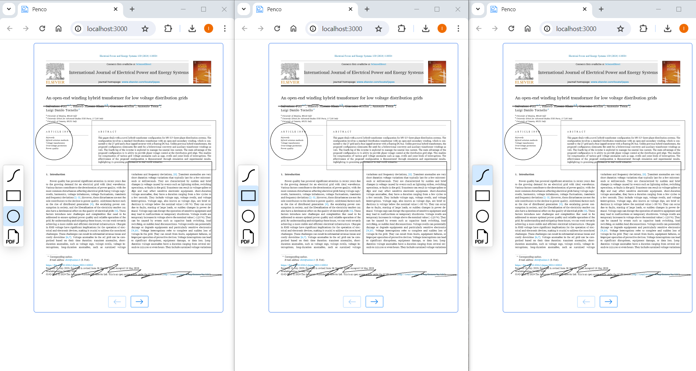

[](https://nodejs.org/en)
[](https://docs.npmjs.com/downloading-and-installing-node-js-and-npm)


<h1>
    <div align="right">
        <code>🇺🇸</code> 
        <a href="README-RU.md">🇷🇺</a>
    </div>
</h1>

## About
A web application for collaboratively drawing and building various geometric shapes on canvas in real time.  
You can upload PDF documents to the graphic canvas as separate objects and draw on their pages.

## Architecture
The architecture of a web application consists of three main components: the server side, the client side, and the
WebSocket protocol.

The connecting component is the WebSocket protocol. To create a bidirectional connection in the system on both the
server and client sides, a special WebSocket instance must be created.


The server initializes an instance of the WebSocket protocol, which monitors client connections and listens for named
events. When any of these events occur, the server processes the data received from the client and immediately sends it
to all other users.

The client also initializes an instance of the WebSocket protocol, which establishes a connection with the server
socket, creates the necessary handlers for events set on the server, and emits the necessary events to send data to the
server.

## Demonstration
#### Collaborative drawing by three users
The screenshot below shows three users drawing on the same canvas.  
Users can draw a line, circle, or rectangle.


#### Collaborative note-taking on a downloaded PDF document
The screenshot below shows three users leaving notes on a single PDF document.  
Users can upload any PDF document, flip through its pages, and leave notes on them.



## Installation and Usage
Clone the repository.  
In the project root and inside the [backend](backend) and [frontend](frontend) directories run the command:
```shell
npm i
```
Inside the [backend](backend) directory run the command:
```shell
npm run dev
```
Inside the [frontend](frontend) directory run the command:
```shell
npm run build
npm run start
```
Open http://localhost:3000/.

To run the site later, just run the `npm run dev` and `npm run start` commands.

## Dependencies
- **Node.js** v16.20.1 or later;
- **npm** v8.19.4 or later.

## Technologies
### WebSocket protocol
- backend: [socket.io](https://www.npmjs.com/package/socket.io) `4.7.5`
- frontend: [socket.io-client](https://www.npmjs.com/package/socket.io-client) `4.7.5`
### Backend
- [TypeScript](https://www.typescriptlang.org/) `5.4.5`
- [Express](https://expressjs.com/) `4.19.2`
### Frontend
- [TypeScript](https://www.typescriptlang.org/) `5.4.5`
- [React](https://react.dev/) `18.3.1`
- [LESS](https://lesscss.org/) `4.2.0`
- [webpack](https://webpack.js.org/) `5.91.0`
